# Software Requirements Specification (SRS)

**Document ID:** SRS-001
**Revision:** 1.0
**Date:** 2026-04-15
**Standard:** ISO/IEC/IEEE 29148:2018

---

## Document Control

| 항목 | 내용 |
|:---|:---|
| **프로젝트명** | AI·xAPI 기반 인재양성 사업 통합 운영 허브 플랫폼 |
| **문서 상태** | Draft |
| **작성자** | Senior Requirements Engineer |
| **승인자** | (TBD) |
| **배포 대상** | 개발팀, QA팀, 프로젝트 관리자, 이해관계자 |

| 버전 | 날짜 | 변경 내용 | 작성자 |
|:---:|:---:|:---|:---|
| 1.0 | 2026-04-15 | 초기 작성 — PRD(VPS v1.0) 기반 전체 SRS 생성 | Senior Requirements Engineer |

---

## 1. Introduction

### 1.1 Purpose

본 문서는 **AI·xAPI 기반 인재양성 사업 통합 운영 허브 플랫폼**(이하 "본 시스템")에 대한 Software Requirements Specification(SRS)이다.

본 시스템은 다음 문제를 해결하기 위해 설계된다:

1. **데이터 파편화 문제**: 지역혁신센터(RISE 사업단) 산하 다수 위탁 기관이 비표준 포맷(HWP, 구형 엑셀 등)으로 성과 데이터를 제출하여, 사업관리 매니저가 월 48시간을 수작업 취합·클렌징에 소비하는 병목.
2. **보고서 무결성 문제**: 수식 오류·누락으로 인한 보고서 반려(월 1~2회 추정)가 발생하여 재작업 부담 및 감사 대응 위험 증가.
3. **지역 인재 이탈 문제**: 앵커기업 신규 채용 1년 내 조기 퇴사율이 약 50%(추정)에 달하며, 지역 정착 의지(Local Fit)를 객관적으로 검증할 수단이 부재.
4. **공공 ROI 입증 불가**: 예산처 설득용 공공 투자 대비 성과를 데이터 기반으로 증명할 도입 명분이 0건.

본 SRS는 ISO/IEC/IEEE 29148:2018 표준을 준수하며, PRD(VPS v1.0)를 유일한 비즈니스/기능 요구의 원천(Source of Truth)으로 사용한다.

### 1.2 Scope

#### 1.2.1 In-Scope (범위 내)

| 범위 ID | 항목 | 설명 | Phase |
|:---|:---|:---|:---:|
| IS-01 | AI 스마트 엑셀·HWP 업로더 | 비표준 포맷 자동 인식·매핑·정제 (F1) | Phase 1 |
| IS-02 | 통합 데이터 허브 | 멀티소스 수집·정제 파이프라인 (F2) | Phase 1 |
| IS-03 | 감사 대응 무결성 리포트 자동 생성 | xAPI 기반 감사 증빙 리포트 (F3) | Phase 1 |
| IS-04 | 플랫폼 내부 배지(Local Fit) 판정 및 관리 | 지역 정착 의지 검증 프로세스 및 프로필 노출 (F4) | Phase 1 |
| IS-04-1 | Open Badge 2.0 스펙 연동 및 외부 발급 | 외부 지갑(Backpack) 반출을 위한 인프라 연동 | Phase 2 |
| IS-05 | 기업용 인재 열람권 | Outbound Recruiting 인재 프로필 열람 (F5) | Phase 1 |
| IS-06 | 관리자 전용 ROI·성과 대시보드 | 성과 가시화 및 ROI 증명 (F6) | Phase 1 |
| IS-07 | LTI 표준 기반 LMS 플러그인 연동 | 기존 LMS 연동 (F7) — 파트너 확보 시 | Phase 2 |
| IS-08 | xAPI 기반 Skill-gap 진단 대시보드 | 역량 진단 대시보드 (F8) | Phase 2 |
| IS-09 | AI 기반 맞춤형 후속 교육 자동 매핑 | 교육 자동 추천 (F9) | Phase 2 |
| IS-10 | CSAP 대응 백엔드 보안 게이트웨이 | 망분리 대응 보안 모듈 (F10) | Phase 2+ |
| IS-11 | 보안 감사 이상무 자동 보고 시스템 | 보안 감사 자동화 (F11) | Phase 2 |

#### 1.2.2 Out-of-Scope (범위 외)

| 범위 ID | 항목 | 사유 |
|:---|:---|:---|
| OS-01 | 빅SI 화이트라벨 Headless API 과금 모듈 (F12) | Phase 3 예약. 황도진 페르소나(DOS=-2.40) 전략적 배제 |
| OS-02 | 중앙부처 탑다운 영업 직접 대응 | MVP 단계 전략적 배제. Phase 2~3에서 SI 컨소시엄 파트너십으로 전환 |
| OS-03 | 온프레미스 전용 설치형 배포 | SaaS 기반 아키텍처 우선. Phase 2+ CSAP 인증 후 하이브리드 검토 |
| OS-04 | 자체 LMS 콘텐츠 저작 도구 | 본 시스템은 LMS 플랫폼이 아닌 운영 허브로 한정 |

#### 1.2.3 Constraints (제약사항) / Assumptions (가정)

**Constraints:**

| 제약 ID | 제약사항 | 근거 |
|:---|:---|:---|
| CON-01 | CSAP 인증 미보유 SaaS는 공공기관 도입 반려율 100% | PRD §1-4 P4-1 |
| CON-02 | 기관별 다기종 포맷(HWP·구형 엑셀) 표준화율 현재 0% | PRD §1-1 P1-4 |
| CON-03 | 레거시 온프레미스 시스템(매몰비용 약 50억 추정) 존재로 대체 불가 → API 플러그인 기생 전략 필수 | PRD §5 레거시 기득권 |
| CON-04 | xAPI 표준 스키마 기반 데이터 구조 채택 필수 | PRD §9-3 Lock-in 및 데이터 이식성 |
| CON-05 | Phase 1 M9 내 C-3/C-2 레퍼런스 3건 선점 필수 (대형 SI 잠식 대응) | PRD §10-3 R4 |

**Assumptions:**

| 가정 ID | 가정 | 검증 방법 |
|:---|:---|:---|
| ASM-01 | AI 매핑으로 데이터 취합 시간 48h → 1h 달성 가능 | 실험 E1: MVP 배포 후 실제 처리 시간 측정 |
| ASM-02 | Local Fit Badge가 면접 전환율을 유의미하게 향상시킨다 | 실험 E4: Badge 열람 → 면접 전환율 ≥ 30% |
| ASM-03 | C-3/C-2 Star 세그먼트가 Phase 1 내 계약 전환된다 | 실험 E5: M9까지 파일럿 계약 3건 |
| ASM-04 | Cascade 효과로 전산처 1명 전환 시 산하 3.5개 기관 자동 확산 | 실험 E8: 산하 기관 도입율 ≥ 70% |
| ASM-05 | 파일럿 기관 수료생 배지 일괄 발급으로 초기 인재 풀 확보 가능 | 실험 E3: Badge 보유자 vs 미보유자 12개월 재직률 비교 |

### 1.3 Definitions, Acronyms, Abbreviations

| 용어 | 정의 |
|:---|:---|
| **xAPI (Experience API)** | 학습 경험 데이터를 표준화된 형식(Actor-Verb-Object)으로 수집·저장하는 e-러닝 국제표준(IEEE 9274.1.1) |
| **RISE** | Regional Innovation System & Education. 지역혁신 기반 교육 체제 구축 국가 사업 |
| **LTI (Learning Tools Interoperability)** | IMS Global 표준. LMS와 외부 도구 간 통합 연동 프로토콜 |
| **Open Badge** | IMS Global Open Badges 2.0 표준 기반 디지털 역량 인증 배지 |
| **Local Fit Badge** | 지역 내 교육 이수, 커뮤니티 활동, 해커톤 참여 등 지역 정착 의지를 증명하는 본 시스템 전용 Open Badge |
| **CSAP** | Cloud Security Assurance Program. 한국인터넷진흥원(KISA) 클라우드 보안 인증 |
| **JTBD (Jobs to be Done)** | 고객이 특정 상황에서 완수하려는 핵심 과업을 정의하는 프레임워크 |
| **AOS (Adjusted Opportunity Score)** | 기회 점수. Importance × (1 - Satisfaction/5) |
| **DOS (Discovered Opportunity Score)** | 발견 기회 점수. (Importance - Satisfaction) × Market Relevance |
| **MoSCoW** | 우선순위 분류 체계: Must / Should / Could / Won't |
| **ICE Score** | Impact·Confidence·Ease 기반 기능 우선순위 점수. (I×4 + C×3 + E×3) × 2 |
| **PLG (Product-Led Growth)** | 제품 자체가 주요 고객 획득·전환·확장 수단이 되는 성장 전략 |
| **Flywheel** | xAPI 데이터 누적 → 분석 정밀도 향상 → 사용자 가치 증가 → 데이터 추가 누적의 선순환 구조 |
| **Cascade 효과** | 전산처 보안 책임자 1명 전환 시 산하 기관 평균 3.5개에 보안 정책이 자동 연쇄 적용되는 파급 효과(MR=350%) |
| **멀티테넌트 (Multi-tenant)** | 단일 인프라에서 복수 기관(테넌트)의 데이터를 논리적으로 분리하여 서비스하는 아키텍처 |
| **컴포저블 SaaS** | 프론트엔드만 교체 납품 가능하되 코어 DB는 중앙 통제하는 모듈형 SaaS 아키텍처 |
| **Validator (검증자)** | Proof 항목의 신뢰도를 검증하는 데이터·실험의 주체 또는 도구 |
| **KSF (Key Success Factor)** | 사업 성공을 위한 핵심 성공 요인 |

### 1.4 References

| 참조 ID | 문서명/출처 | 설명 |
|:---|:---|:---|
| REF-01 | VPS v1.0 (VPS_v1.0.md) | 본 SRS의 유일한 비즈니스/기능 요구 원천 문서 (PRD) |
| REF-02 | `#1` Porter 5-Forces 분석 | 산업 구조 분석 |
| REF-03 | `#2` 통합 경쟁사 전략 보고서 | 경쟁사 과금 모델 및 전략 분석 |
| REF-04 | `#3` 벤치마킹 통합 보고서 | 경쟁사 기능·CSAP·LTI 벤치마크 |
| REF-05 | `#4` KSF 다중 오케스트레이션 | 핵심 성공 요인 및 방어선 전략 |
| REF-06 | `#5` 문제 정의 비교 분석 | Value Proposition 도출 근거 |
| REF-07 | `#6` Market Segment Map | 세그먼트별 시장 매력도 점수 |
| REF-08 | `#7` 페르소나 스펙트럼 최종 완성본 | 페르소나 상세 정보 |
| REF-09 | `#8` 고객여정지도 | 고객 여정 분석 |
| REF-10 | `#9` DOS 기반 시장기회 분석 | DOS/AOS 기반 시장 기회 평가 |
| REF-11 | `#10` JTBD 인터뷰 결과 보고서 | 고객 인터뷰 원본 데이터 |
| REF-12 | ISO/IEC/IEEE 29148:2018 | Systems and software engineering — Life cycle processes — Requirements engineering |
| REF-13 | IEEE 9274.1.1 (xAPI) | Experience API 국제표준 |
| REF-14 | IMS Global Open Badges 2.0 | 디지털 역량 인증 배지 표준 |
| REF-15 | IMS Global LTI 1.3 | Learning Tools Interoperability 표준 |

---

## 2. Stakeholders

| 역할 (Role) | 대표 페르소나 | 책임 (Responsibility) | 관심사 (Interest) | 세그먼트/AOS/DOS |
|:---|:---|:---|:---|:---|
| **사업관리 매니저** (Core) | 김지수 | 위탁 기관 데이터 수합·정제, 성과 보고서 작성, 감사 대응 | 데이터 취합 자동화, 보고서 무결성, 감사 즉시 대응, ROI 가시화 | C-3 도 단위 지역혁신기관 / AOS=3.5 / DOS=4.20 |
| **앵커기업 HR 담당자** (Core 2순위) | 최수영 | 지역 인재 채용, 채용 후 재직률 관리, 인재 검증 | Local Fit 검증, 허수 지원자 필터링, 조기 이탈 방지 | 지역혁신기관 연계 B2B / AOS=3.0 / DOS=3.00 |
| **민간 HRD 기획자** (Adjacent) | 강은지 | 사내교육 기획, 교육 ROI 증명, Skill-gap 진단 | xAPI 기반 역량 가시화, 교육 투자 성과 데이터화 | B2B 민간 HRD / AOS=1.2 / DOS=0.30 |
| **전산처 보안 책임자** (Extreme) | 신동민 | 보안 감사 대응, SaaS 도입 보안 검토, 레거시 장애 방지 | CSAP 인증, 망분리 준수, 보안감사 이상무, 무장애 운영 | Q3 유지관리/확장기회 / AOS=0.9 / DOS=1.75 (MR=350%) |
| **중앙부처 예산 관료** (Non-user) | 황도진 | 거대 사업 예산 총괄, 정책 결정 | Phase 1 전략적 배제. Phase 2~3 SI 컨소시엄 파트너십 | Q4 기각 / AOS=0.4 / DOS=-2.40 |
| **시스템 관리자** | (내부) | 플랫폼 운영·모니터링, 장애 대응, 테넌트 관리 | 시스템 안정성, 모니터링 가시성, 장애 복구 시간 | — |
| **개발팀** | (내부) | 시스템 설계·구현·테스트·배포 | 기술 실현 가능성, 아키텍처 일관성 | — |

---

## 3. System Context and Interfaces

### 3.1 External Systems

| 시스템 ID | 외부 시스템명 | 연동 방식 | 설명 |
|:---|:---|:---|:---|
| EXT-01 | 위탁 기관 데이터 소스 | 파일 업로드(엑셀, HWP, CSV) | 기관별 비표준 포맷 성과 데이터 원본 |
| EXT-02 | xAPI LRS (Learning Record Store) | xAPI 표준 REST API | 학습 경험 데이터 수집·저장 백엔드 |
| EXT-03 | 기존 LMS (자이닉스 코스모스 등) | LTI 1.3 프로토콜 | 기관 기존 학사망 LMS 연동 |
| EXT-04 | Open Badge 인프라 | IMS Open Badges 2.0 API | 디지털 배지 발급·검증·호스팅 |
| EXT-05 | 기관 HR/ERP 시스템 | REST API / 파일 연동 | 채용 데이터, 재직 이력, 인사 정보 연동 |
| EXT-06 | Mixpanel / 분석 플랫폼 | SDK·API | 사용자 행동 분석, 퍼널 트래킹 |
| EXT-07 | 알림·커뮤니케이션 서비스 | Webhook / SMTP / Push | 업로드 완료, 에러 알림, 보고서 생성 알림 |
| EXT-08 | 클라우드 인프라 (CSP) | IaaS/PaaS API | 컴퓨팅 리소스, 스토리지, 네트워크 |

### 3.2 Client Applications

| 클라이언트 ID | 클라이언트 | 사용자 | 주요 기능 접근 |
|:---|:---|:---|:---|
| CLI-01 | 웹 애플리케이션 (관리자용) | 김지수(사업관리 매니저) | F1, F2, F3, F6 — 데이터 업로드, 대시보드, 리포트 |
| CLI-02 | 웹 애플리케이션 (기업 HR용) | 최수영(앵커기업 HR) | F4, F5 — Badge 열람, 인재 검색, Outbound Recruiting |
| CLI-03 | 웹 애플리케이션 (학습자용) | 수료생/학습자 | Badge 프로필 관리, 학습 이력 조회 |
| CLI-04 | 관리 콘솔 (시스템 관리자용) | 시스템 관리자 | 테넌트 관리, 모니터링, 설정 |

### 3.3 API Overview

| API 그룹 | 엔드포인트 패턴 | 프로토콜 | 인증 방식 | 설명 |
|:---|:---|:---|:---|:---|
| 데이터 업로드 API | `/api/v1/upload/*` | HTTPS (REST) | OAuth 2.0 + API Key | F1: 파일 업로드, 포맷 자동 인식, 매핑 |
| 데이터 허브 API | `/api/v1/hub/*` | HTTPS (REST) | OAuth 2.0 | F2: 수집·정제·표준화 파이프라인 |
| 리포트 API | `/api/v1/reports/*` | HTTPS (REST) | OAuth 2.0 | F3: 무결성 리포트 생성·조회·다운로드 |
| Badge API | `/api/v1/badges/*` | HTTPS (REST) | OAuth 2.0 | F4: Open Badge 발급·조회·검증 |
| 인재 열람 API | `/api/v1/talent/*` | HTTPS (REST) | OAuth 2.0 + 열람권 토큰 | F5: 인재 프로필 검색·열람 |
| 대시보드 API | `/api/v1/dashboard/*` | HTTPS (REST) | OAuth 2.0 | F6: ROI·성과 지표 조회 |
| LTI 연동 API | `/lti/v1.3/*` | HTTPS (LTI 1.3) | LTI 1.3 Security | F7: LMS 플러그인 연동 |
| xAPI 프록시 API | `/xapi/v1/*` | HTTPS (xAPI) | OAuth 2.0 | xAPI Statement 수집·조회 |
| 관리 API | `/api/v1/admin/*` | HTTPS (REST) | OAuth 2.0 (Admin Role) | 테넌트·사용자·권한 관리 |

### 3.4 Use Case Diagram

> 5개 Actor와 시스템 기능(Use Case) 간 관계를 정의한다. Phase 1 MVP 기능(F1~F7)을 대상으로 한다.

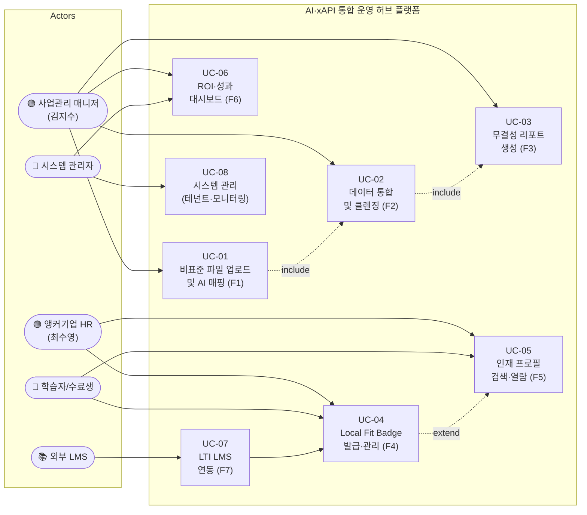

| Use Case ID | Use Case 명 | 주요 Actor | 관련 Feature | 관련 REQ-FUNC |
|:---|:---|:---|:---|:---|
| UC-01 | 비표준 파일 업로드 및 AI 매핑 | 사업관리 매니저 | F1 | REQ-FUNC-001~006 |
| UC-02 | 데이터 통합 및 클렌징 | 사업관리 매니저 | F2 | REQ-FUNC-007~012 |
| UC-03 | 무결성 리포트 생성 | 사업관리 매니저 | F3 | REQ-FUNC-013~018 |
| UC-04 | Local Fit Badge 발급·관리 | 학습자, 앵커기업 HR | F4 | REQ-FUNC-019~023 |
| UC-05 | 인재 프로필 검색·열람 | 앵커기업 HR, 학습자 | F5 | REQ-FUNC-024~028 |
| UC-06 | ROI·성과 대시보드 조회 | 사업관리 매니저, 시스템 관리자 | F6 | REQ-FUNC-029~034 |
| UC-07 | LTI LMS 연동 | 외부 LMS | F7 | REQ-FUNC-035~037 |
| UC-08 | 시스템 관리 (테넌트·모니터링) | 시스템 관리자 | 공통 | REQ-FUNC-038~044 |

### 3.5 Component Diagram

> 시스템 내부 컴포넌트의 계층 구조(Client → API → Service → Data)와 외부 시스템 간 의존 관계를 정의한다.

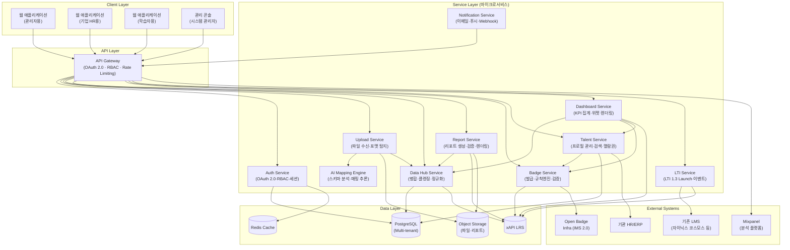

| 계층 | 컴포넌트 | 역할 | 통신 프로토콜 |
|:---|:---|:---|:---|
| **Client** | WebAdmin, WebHR, WebLearner, AdminConsole | 사용자 인터페이스 | HTTPS |
| **API** | API Gateway | 인증·인가·라우팅·Rate Limiting | HTTPS (REST) |
| **Service** | Upload, AI Mapping, Data Hub, Report, Badge, Talent, Dashboard, LTI, Notification, Auth | 비즈니스 로직 처리 | gRPC / REST (내부) |
| **Data** | PostgreSQL, xAPI LRS, Object Storage, Redis | 데이터 영속화·캐싱 | TCP/TLS |
| **External** | LMS, Open Badge, HR/ERP, Mixpanel | 외부 연동 | HTTPS (REST/LTI 1.3/xAPI) |

### 3.6 Interaction Sequences (핵심 시퀀스 다이어그램)

#### 3.6.1 핵심 시퀀스 1: AI 스마트 업로더를 통한 데이터 자동 수집·정제 (F1 + F2)

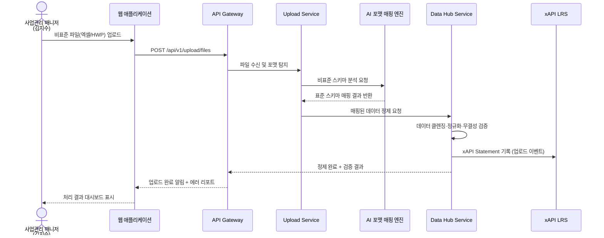

#### 3.6.2 핵심 시퀀스 2: 감사 대응 무결성 리포트 자동 생성 (F3)

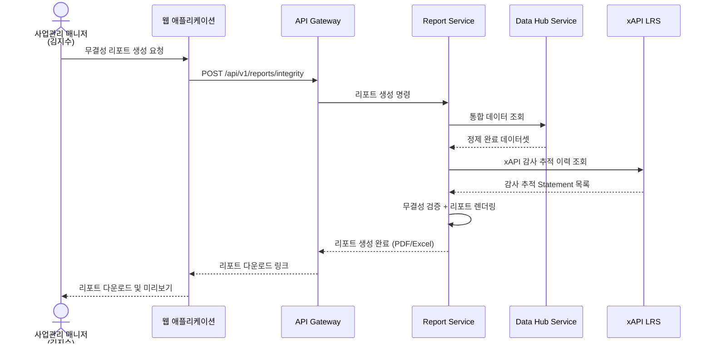

#### 3.6.3 핵심 시퀀스 3: Local Fit Open Badge 발급 및 인재 매칭 (F4 + F5)

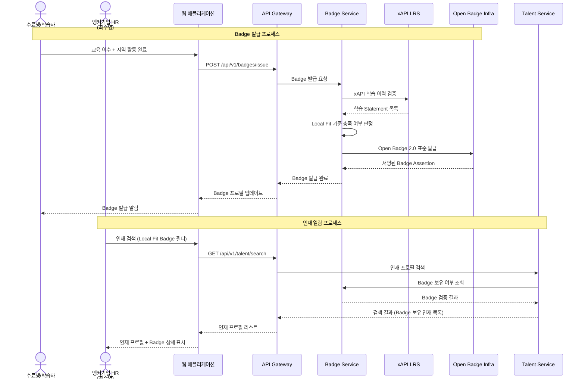

---

## 4. Specific Requirements

### 4.1 Functional Requirements

> 모든 기능 요구사항은 PRD(VPS v1.0) §8 JobMVP Feature Map의 F1~F6(Phase 1 MVP) 기능을 다수의 REQ-FUNC로 분해한 것이다.

#### 4.1.1 F1 — AI 스마트 엑셀·HWP 업로더 (포맷 자동 매핑)

| Req ID | 요구사항 | Source | Priority | Acceptance Criteria |
|:---|:---|:---|:---:|:---|
| REQ-FUNC-001 | 시스템은 엑셀(.xlsx, .xls), HWP(.hwp), CSV(.csv) 파일 형식의 업로드를 지원해야 한다. | JTBD-1 / F1 | Must | **Given** 사용자가 지원 포맷(xlsx, xls, hwp, csv) 파일을 선택했을 때 **When** 업로드 버튼을 클릭하면 **Then** 시스템은 파일을 수신하고 포맷을 정확히 식별하여 "업로드 성공" 상태를 반환한다. |
| REQ-FUNC-002 | 시스템은 업로드된 파일의 컬럼 구조를 AI 엔진으로 자동 분석하여 표준 스키마에 매핑해야 한다. | JTBD-1 / F1 / P1-1 | Must | **Given** 비표준 컬럼명을 포함한 엑셀 파일이 업로드되었을 때 **When** AI 매핑 엔진이 실행되면 **Then** 시스템은 5분 이내에 표준 스키마 매핑 제안을 생성하고, 매핑 정확도 90% 이상을 달성한다. |
| REQ-FUNC-003 | 시스템은 AI 매핑 결과를 사용자에게 미리보기로 제공하고, 수동 보정 기능을 지원해야 한다. | JTBD-1 / F1 | Must | **Given** AI 매핑 제안이 생성되었을 때 **When** 사용자가 매핑 미리보기 화면을 열면 **Then** 원본 컬럼과 표준 컬럼의 매핑 관계가 테이블로 표시되고, 사용자가 특정 매핑을 수동으로 변경할 수 있다. |
| REQ-FUNC-004 | 시스템은 1회 업로드당 동시에 10개 이상의 파일을 일괄 처리할 수 있어야 한다. | JTBD-1 (10개 이상 위탁 기관) | Must | **Given** 사용자가 10개의 파일을 동시 선택했을 때 **When** 일괄 업로드를 실행하면 **Then** 시스템은 모든 파일을 순차 또는 병렬로 처리하고, 각 파일의 개별 처리 상태를 실시간으로 표시한다. |
| REQ-FUNC-005 | 시스템은 업로드 실패 시 실패 원인(포맷 미지원, 파일 손상, 용량 초과 등)을 명확히 표시하고 재시도 기능을 제공해야 한다. | F1 | Must | **Given** 파일 업로드가 실패했을 때 **When** 에러 상태가 반환되면 **Then** 시스템은 실패 원인 코드와 설명을 표시하고, "재시도" 버튼을 제공한다. |
| REQ-FUNC-006 | 시스템은 이전에 학습된 기관별 매핑 패턴을 저장하여 동일 기관의 후속 업로드 시 자동 적용해야 한다. | JTBD-1 / F1 / P1-4 | Must | **Given** 기관 A의 파일을 이전에 매핑 완료한 이력이 존재할 때 **When** 기관 A의 신규 파일이 업로드되면 **Then** 시스템은 저장된 매핑 패턴을 자동 적용하고, 사용자에게 "이전 패턴 자동 적용됨" 알림을 표시한다. |

#### 4.1.2 F2 — 통합 데이터 허브 (멀티소스 수집·정제 파이프라인)

| Req ID | 요구사항 | Source | Priority | Acceptance Criteria |
|:---|:---|:---|:---:|:---|
| REQ-FUNC-007 | 시스템은 다수 위탁 기관의 매핑 완료 데이터를 단일 통합 스키마로 병합(Merge)해야 한다. | JTBD-1 / F2 | Must | **Given** 5개 이상 기관의 매핑 완료 데이터가 존재할 때 **When** 데이터 병합을 실행하면 **Then** 시스템은 모든 데이터를 단일 통합 테이블로 병합하고, 병합 건수와 중복 제거 건수를 리포트한다. |
| REQ-FUNC-008 | 시스템은 통합 데이터에 대해 자동 데이터 클렌징(결측값 탐지, 이상값 플래깅, 수식 검증)을 수행해야 한다. | JTBD-1 / F2 / P1-2 | Must | **Given** 통합 데이터셋이 생성되었을 때 **When** 자동 클렌징 프로세스가 실행되면 **Then** 시스템은 결측값, 이상값, 수식 오류를 탐지하여 항목별 플래그를 부여하고, 오류 건수 요약을 사용자에게 제공한다. |
| REQ-FUNC-009 | 시스템은 클렌징 과정에서 발견된 오류에 대해 자동 보정 제안을 생성해야 한다. | JTBD-1 / F2 / P1-2 | Must | **Given** 데이터 클렌징에서 수식 오류가 탐지되었을 때 **When** 오류 상세 화면을 열면 **Then** 시스템은 원본값, 오류 유형, 보정 제안값을 함께 표시하고, 사용자가 "적용" 또는 "무시"를 선택할 수 있다. |
| REQ-FUNC-010 | 시스템은 모든 데이터 변환·정제 과정을 xAPI Statement로 기록하여 감사 추적 가능성을 보장해야 한다. | JTBD-1 / F2 / F3 | Must | **Given** 데이터 정제 프로세스가 완료되었을 때 **When** 감사 이력을 조회하면 **Then** xAPI LRS에 기록된 Statement에는 Actor(처리자), Verb(정제/보정/병합), Object(대상 데이터셋), Timestamp가 포함되어 있다. |
| REQ-FUNC-011 | 시스템은 통합 데이터에 대해 기관별, 지표별, 기간별 필터링 및 정렬 기능을 제공해야 한다. | F2 / F6 | Must | **Given** 통합 데이터가 존재할 때 **When** 사용자가 기관명, 지표 유형, 기간을 필터 조건으로 설정하면 **Then** 시스템은 1초 이내에 필터 결과를 반환한다. |
| REQ-FUNC-012 | 시스템은 데이터 변경 이력(Version History)을 유지하여 특정 시점의 데이터 상태로 롤백할 수 있어야 한다. | F2 / P1-2 | Must | **Given** 통합 데이터에 대해 3회의 수정이 발생했을 때 **When** 사용자가 2회차 시점으로 롤백을 요청하면 **Then** 시스템은 해당 시점의 데이터 상태를 복원하고, 롤백 이벤트를 xAPI로 기록한다. |

#### 4.1.3 F3 — 감사 대응 무결성 리포트 자동 생성 (xAPI 기반)

| Req ID | 요구사항 | Source | Priority | Acceptance Criteria |
|:---|:---|:---|:---:|:---|
| REQ-FUNC-013 | 시스템은 통합 데이터 기반으로 감사 대응 무결성 리포트를 자동 생성해야 한다. | JTBD-1 / F3 / P1-3 | Must | **Given** 데이터 정제가 완료되고 xAPI 감사 이력이 존재할 때 **When** 사용자가 "무결성 리포트 생성" 버튼을 클릭하면 **Then** 시스템은 3분 이내에 리포트를 생성하고 다운로드 링크를 제공한다. |
| REQ-FUNC-014 | 무결성 리포트에는 데이터 원본 출처, 정제 이력, 오류 보정 내역, 최종 검증 결과가 포함되어야 한다. | F3 / P1-3 | Must | **Given** 무결성 리포트가 생성되었을 때 **When** 리포트 내용을 확인하면 **Then** 다음 섹션이 모두 포함되어 있다: (1)원본 파일 출처 목록, (2)정제 프로세스 이력, (3)오류 보정 전/후 비교, (4)최종 데이터 무결성 검증 결과. |
| REQ-FUNC-015 | 시스템은 리포트를 PDF 및 Excel 형식으로 내보내기(Export)할 수 있어야 한다. | F3 | Must | **Given** 무결성 리포트가 생성 완료 상태일 때 **When** 사용자가 PDF 또는 Excel 내보내기를 선택하면 **Then** 시스템은 30초 이내에 해당 형식의 파일을 생성하여 다운로드를 시작한다. |
| REQ-FUNC-016 | 시스템은 리포트 생성 시 xAPI Statement로 리포트 생성 이벤트를 기록하여 '누가, 언제, 어떤 데이터 기준으로 리포트를 생성했는지' 추적 가능해야 한다. | F3 | Must | **Given** 무결성 리포트가 생성되었을 때 **When** 감사 관리자가 리포트 생성 이력을 조회하면 **Then** xAPI Statement에 Actor(생성자), Verb(generated), Object(리포트 ID), Context(데이터셋 버전, 기간)가 기록되어 있다. |
| REQ-FUNC-017 | 시스템은 예약 스케줄에 따라 주기적(일간/주간/월간)으로 리포트를 자동 생성하고 지정된 수신자에게 알림을 발송해야 한다. | F3 | Should | **Given** 월간 자동 리포트 스케줄이 설정되었을 때 **When** 설정된 일시가 도래하면 **Then** 시스템은 자동으로 리포트를 생성하고, 지정된 수신자 전원에게 이메일 또는 인앱 알림을 발송한다. |
| REQ-FUNC-018 | 시스템은 리포트 내 에러(누락·수식 깨짐) 건수를 0건으로 보장하는 자동 검증 로직을 적용해야 한다. | F3 / O3 | Must | **Given** 리포트 생성 프로세스가 실행될 때 **When** 최종 렌더링 직전 자동 검증이 수행되면 **Then** 수식 무결성 체크, 누락 필드 체크, 데이터 타입 일관성 체크를 모두 통과한 경우에만 리포트가 생성되고, 1건이라도 실패 시 에러 리포트를 생성하여 사용자에게 보정을 요청한다. |

#### 4.1.4 F4 — Local Fit Open Badge 발급·관리 시스템

| Req ID | 요구사항 | Source | Priority | Acceptance Criteria |
|:---|:---|:---|:---:|:---|
| REQ-FUNC-019 | 시스템은 IMS Open Badges 2.0 표준을 준수하여 Local Fit Open Badge를 발급해야 한다. | JTBD-2 / F4 / P2-3 | Must | **Given** 학습자가 Local Fit 기준(교육 이수, 지역 활동, 해커톤 참여 등)을 충족했을 때 **When** Badge 발급 프로세스가 실행되면 **Then** IMS Open Badges 2.0 표준에 부합하는 서명된 Badge Assertion이 생성되고, 학습자 프로필에 자동 등록된다. |
| REQ-FUNC-020 | 시스템은 Local Fit Badge 발급 기준을 관리자가 설정·수정할 수 있는 규칙 엔진을 제공해야 한다. | F4 | Must | **Given** 관리자가 Badge 발급 규칙 설정 화면에 접근했을 때 **When** "지역 교육 이수 3회 이상 + 해커톤 참여 1회 이상" 조건을 설정하면 **Then** 시스템은 해당 규칙을 저장하고, 이후 조건 충족 학습자에게 자동 발급 프로세스를 적용한다. |
| REQ-FUNC-021 | 시스템은 발급된 Badge의 진위를 제3자가 검증(Verification)할 수 있는 공개 검증 URL을 제공해야 한다. | F4 | Must | **Given** Local Fit Badge가 발급되었을 때 **When** 기업 HR 담당자가 Badge 검증 URL에 접근하면 **Then** Badge 발급 기관, 발급일, 충족 기준, 유효 여부가 표시된다. |
| REQ-FUNC-022 | 시스템은 xAPI LRS에 기록된 학습 이력을 기반으로 Badge 발급 자격을 자동 판정해야 한다. | F4 / JTBD-2 | Must | **Given** 학습자의 xAPI Statement가 LRS에 축적되었을 때 **When** 자동 판정 엔진이 실행되면 **Then** 시스템은 설정된 규칙과 xAPI 이력을 대조하여 자격 충족 여부를 판정하고 결과를 반환한다. |
| REQ-FUNC-023 | 시스템은 Badge 발급·조회·검증 이력을 대시보드에서 집계하여 발급 건수, 열람률, 면접 전환율 KPI를 표시해야 한다. | F4 / O4 | Must | **Given** Badge가 10건 이상 발급되었을 때 **When** 관리자가 Badge 대시보드에 접근하면 **Then** 총 발급 건수, 기업별 열람 건수, 열람 → 면접 부름 전환율이 표시된다. |

#### 4.1.5 F5 — 기업용 인재 열람권 (Outbound Recruiting)

| Req ID | 요구사항 | Source | Priority | Acceptance Criteria |
|:---|:---|:---|:---:|:---|
| REQ-FUNC-024 | 시스템은 기업 HR 담당자에게 Badge 보유 인재 프로필 검색 기능을 제공해야 한다. | JTBD-2 / F5 / P2-2 | Should | **Given** 기업 HR 담당자가 인재 검색 화면에 접근했을 때 **When** "Local Fit Badge 보유" + "직무: 백엔드 개발" 필터를 적용하면 **Then** 시스템은 조건에 부합하는 인재 프로필 목록을 2초 이내에 반환한다. |
| REQ-FUNC-025 | 시스템은 인재 프로필 열람 시 열람권(크레딧) 기반 과금을 적용해야 한다. | F5 / §9 Track 2 | Should | **Given** 기업이 열람권 10건을 보유하고 있을 때 **When** 인재 프로필 상세 조회를 1건 실행하면 **Then** 시스템은 열람 가능 확인 후 상세 프로필을 표시하고, 잔여 열람권을 9건으로 차감한다. |
| REQ-FUNC-026 | 시스템은 인재 프로필에 Badge 상세, xAPI 기반 학습 이력 요약, 지역 활동 이력을 포함하여 표시해야 한다. | F5 / JTBD-2 | Should | **Given** 기업 HR가 인재 상세 프로필을 열람했을 때 **When** 프로필 페이지가 로드되면 **Then** (1)보유 Badge 목록 및 상세, (2)최근 12개월 학습 이력 요약, (3)지역 커뮤니티 활동 이력이 모두 표시된다. |
| REQ-FUNC-027 | 시스템은 기업 HR의 인재 열람 행위를 xAPI로 기록하고, 열람 → 면접 전환율 추적을 지원해야 한다. | F5 / O5 | Should | **Given** 기업 HR이 인재 프로필을 열람했을 때 **When** 열람 이벤트가 발생하면 **Then** xAPI Statement(Actor=HR, Verb=viewed, Object=인재프로필)가 LRS에 기록되고, 이후 면접 제안 이벤트와 연결하여 전환율 산출이 가능하다. |
| REQ-FUNC-028 | 시스템은 인재에게 기업의 관심 알림(익명/실명 선택)을 발송할 수 있는 기능을 제공해야 한다. | F5 | Should | **Given** 기업 HR이 특정 인재에 관심 표시를 했을 때 **When** "관심 알림 발송" 버튼을 클릭하면 **Then** 인재에게 "귀하의 프로필에 관심을 표시한 기업이 있습니다" 알림이 발송되고(익명/실명 선택 가능), 알림 이벤트가 기록된다. |

#### 4.1.6 F6 — 관리자 전용 ROI·성과 대시보드

| Req ID | 요구사항 | Source | Priority | Acceptance Criteria |
|:---|:---|:---|:---:|:---|
| REQ-FUNC-029 | 시스템은 데이터 취합 소요 시간(AS-IS vs TO-BE) 추이를 실시간 대시보드로 표시해야 한다. | JTBD-1 / F6 / O1 | Must | **Given** 월간 데이터 처리 이력이 3개월 이상 축적되었을 때 **When** 관리자가 ROI 대시보드에 접근하면 **Then** 월별 데이터 취합 소요 시간 추이 그래프가 표시되고, AS-IS(48h) 대비 현재 소요 시간이 수치로 비교된다. |
| REQ-FUNC-030 | 시스템은 보고서 에러 건수 KPI(목표: 0건/월)를 추적하고, 임계치 초과 시 알림을 발송해야 한다. | F6 / O3 | Must | **Given** 보고서 에러 추적이 활성화되었을 때 **When** 월간 에러 건수가 1건 이상 발생하면 **Then** 시스템은 관리자에게 즉시 알림을 발송하고, 에러 상세(유형, 발생 위치, 영향 범위)를 대시보드에 표시한다. |
| REQ-FUNC-031 | 시스템은 Local Fit Badge 발급 건수, 기업 열람 건수, 면접 전환율 KPI를 대시보드에서 집계·표시해야 한다. | F6 / O2 / O4 / O5 | Must | **Given** Badge 발급 및 열람 이력이 존재할 때 **When** 관리자가 인재 매칭 KPI 대시보드에 접근하면 **Then** (1)총 Badge 발급 건수, (2)기업별 열람 건수, (3)열람→면접 전환율, (4)채용 확정 건수가 표시된다. |
| REQ-FUNC-032 | 시스템은 기관별 데이터 품질 점수(Data Quality Score)를 산출하고 순위로 표시해야 한다. | F6 / F2 | Must | **Given** 3개 이상 기관의 데이터가 통합되었을 때 **When** 관리자가 데이터 품질 대시보드에 접근하면 **Then** 기관별 결측값 비율, 이상값 비율, 표준화 준수율 기반 품질 점수가 산출되어 순위표로 표시된다. |
| REQ-FUNC-033 | 시스템은 대시보드 위젯의 배치를 관리자가 커스터마이징(Drag & Drop)할 수 있어야 한다. | F6 | Should | **Given** 관리자가 대시보드 편집 모드에 진입했을 때 **When** 위젯을 드래그하여 위치를 변경하면 **Then** 변경된 레이아웃이 저장되고 다음 접속 시에도 유지된다. |
| REQ-FUNC-034 | 시스템은 대시보드 데이터를 CSV·PDF로 내보내기할 수 있어야 한다. | F6 | Must | **Given** 대시보드에 데이터가 표시되었을 때 **When** 사용자가 "내보내기" 버튼을 클릭하면 **Then** 현재 표시 중인 데이터를 CSV 또는 PDF 형식으로 5초 이내에 생성하여 다운로드를 시작한다. |

#### 4.1.7 F7 — LTI 표준 기반 기존 LMS 플러그인 연동 (조건부)

| Req ID | 요구사항 | Source | Priority | Acceptance Criteria |
|:---|:---|:---|:---:|:---|
| REQ-FUNC-035 | 시스템은 LTI 1.3 표준에 따라 외부 LMS와의 플러그인 연동을 지원해야 한다. | JTBD-4 / F7 | Should | **Given** LTI 1.3 호환 LMS(자이닉스 코스모스 등)에서 연동 설정을 완료했을 때 **When** LMS 내에서 본 시스템 플러그인을 호출하면 **Then** SSO(Single Sign-On)가 수행되고, 본 시스템의 데이터 뷰가 LMS 내에 임베드되어 표시된다. |
| REQ-FUNC-036 | 시스템은 LTI 연동 시 LMS의 사용자 컨텍스트(과목, 역할, 기관)를 수신하여 적절한 데이터 범위를 제한해야 한다. | F7 | Should | **Given** LMS에서 LTI Launch 요청이 수신되었을 때 **When** 사용자 컨텍스트를 파싱하면 **Then** 시스템은 해당 사용자의 기관 및 과목에 해당하는 데이터만 표시한다. |
| REQ-FUNC-037 | 시스템은 LTI 연동을 통해 LMS 학습 활동 데이터를 xAPI Statement로 변환하여 LRS에 저장해야 한다. | F7 | Should | **Given** LMS에서 학습 활동(수강 완료, 과제 제출 등) 이벤트가 발생했을 때 **When** LTI 채널을 통해 이벤트가 수신되면 **Then** 시스템은 해당 이벤트를 xAPI Statement로 변환하여 LRS에 저장하고, 변환 로그를 기록한다. |

#### 4.1.8 공통 기능 (인증·권한·멀티테넌시)

| Req ID | 요구사항 | Source | Priority | Acceptance Criteria |
|:---|:---|:---|:---:|:---|
| REQ-FUNC-038 | 시스템은 OAuth 2.0 기반 인증을 지원하고, 역할 기반 접근 제어(RBAC)를 적용해야 한다. | 전체 | Must | **Given** "사업관리 매니저" 역할의 사용자가 로그인했을 때 **When** 인재 열람 메뉴에 접근하면 **Then** 권한 부족 오류(403)가 반환된다. "기업 HR" 역할의 사용자가 동일 메뉴에 접근하면 정상 접근이 허용된다. |
| REQ-FUNC-039 | 시스템은 멀티테넌트 아키텍처를 지원하여 기관별 데이터를 논리적으로 분리해야 한다. | 전체 / CON-03 | Must | **Given** 기관 A와 기관 B가 동일 시스템을 사용할 때 **When** 기관 A 사용자가 데이터 조회를 수행하면 **Then** 기관 B의 데이터는 조회·접근이 불가능하다. |
| REQ-FUNC-040 | 시스템은 사용자 활동(로그인, 데이터 조회, 수정, 삭제)에 대한 감사 로그를 자동 기록해야 한다. | 전체 | Must | **Given** 사용자가 데이터를 수정했을 때 **When** 감사 로그를 조회하면 **Then** 수정자, 수정 시각, 수정 전/후 값, 클라이언트 IP가 기록되어 있다. |
| REQ-FUNC-041 | 시스템은 사용자 비밀번호를 bcrypt 또는 동등 이상의 알고리즘으로 해시하여 저장해야 한다. | 전체 / 보안 | Must | **Given** 사용자가 비밀번호를 설정했을 때 **When** 데이터베이스에 저장되면 **Then** 비밀번호는 평문이 아닌 bcrypt(cost factor >= 12) 해시로 저장된다. |
| REQ-FUNC-042 | 시스템은 모든 API 요청·응답을 구조화된 로그로 기록해야 한다(요청 ID, 타임스탬프, 엔드포인트, 응답 코드, 지연 시간 포함). | 전체 | Must | **Given** API 요청이 처리되었을 때 **When** 로그를 조회하면 **Then** 요청 ID(UUID), 타임스탬프(ISO 8601), 엔드포인트, HTTP 메서드, 응답 코드, 처리 지연 시간(ms)이 구조화된 JSON 형식으로 기록되어 있다. |
| REQ-FUNC-043 | 시스템은 알림(이메일, 인앱 푸시) 채널을 지원하고, 사용자별 알림 선호도 설정 기능을 제공해야 한다. | 전체 | Should | **Given** 사용자가 알림 설정 화면에 접근했을 때 **When** "이메일 수신 안 함, 인앱만 수신" 으로 변경하면 **Then** 이후 발생하는 알림은 이메일 대신 인앱 푸시로만 전달된다. |
| REQ-FUNC-044 | 시스템은 한국어 UI를 기본으로 제공하며, 향후 영어 UI 확장을 위한 i18n(국제화) 구조를 갖춰야 한다. | 전체 | Must | **Given** 시스템이 초기 배포되었을 때 **When** 사용자가 로그인하면 **Then** 모든 UI 텍스트가 한국어로 표시되고, 언어 리소스 파일이 키-값 구조로 분리되어 관리된다. |

---

### 4.2 Non-Functional Requirements

#### 4.2.1 성능 (Performance)

| Req ID | 요구사항 | 측정 기준 | 목표값 | Source |
|:---|:---|:---|:---|:---|
| REQ-NF-001 | 데이터 취합·클렌징 전체 프로세스 소요 시간 | 월간 전체 처리 시간 | <= 1h/월 (AS-IS: 48h/월) | O1 / DV-1 |
| REQ-NF-002 | AI 스마트 업로더 포맷 매핑 응답 시간 | p95 응답 지연 | <= 5초 (파일당, 10MB 기준) | F1 |
| REQ-NF-003 | 무결성 리포트 생성 소요 시간 | p95 응답 지연 | <= 3분 (리포트당) | F3 / REQ-FUNC-013 |
| REQ-NF-004 | 인재 검색 API 응답 시간 | p95 응답 지연 | <= 2초 | F5 / REQ-FUNC-024 |
| REQ-NF-005 | 대시보드 초기 로딩 시간 | p95 응답 지연 | <= 3초 | F6 |
| REQ-NF-006 | API 전체 처리량 | 동시 요청 수 | >= 100 동시 요청 처리 (Phase 1 기준) | 전체 |
| REQ-NF-007 | 파일 업로드 용량 제한 | 단일 파일 최대 크기 | <= 50MB/파일, 일괄 업로드 <= 500MB | F1 |

#### 4.2.2 가용성 (Availability)

| Req ID | 요구사항 | 측정 기준 | 목표값 | Source |
|:---|:---|:---|:---|:---|
| REQ-NF-008 | 시스템 가용성 SLA | 월간 가동률 | >= 99.5% (월간 최대 허용 다운타임: 3.6시간) | O6 / P4-2 |
| REQ-NF-009 | 재해 복구 목표 시점(RPO) | 데이터 손실 허용 범위 | <= 1시간 | 전체 |
| REQ-NF-010 | 재해 복구 목표 시간(RTO) | 서비스 복구 소요 시간 | <= 4시간 | 전체 |
| REQ-NF-011 | 예정된 유지보수 다운타임 | 사전 공지 기간 | >= 72시간 전 공지 | 전체 |

#### 4.2.3 보안 (Security)

| Req ID | 요구사항 | 측정 기준 | 목표값 | Source |
|:---|:---|:---|:---|:---|
| REQ-NF-012 | 모든 클라이언트-서버 통신은 TLS 1.2 이상으로 암호화해야 한다. | 통신 프로토콜 | TLS 1.2+ 100% 적용 | P4-1 |
| REQ-NF-013 | 역할 기반 접근 제어(RBAC)를 적용하여 최소 권한 원칙을 준수해야 한다. | 권한 위반 건수 | 0건/월 | 전체 |
| REQ-NF-014 | 개인정보 데이터는 AES-256 이상으로 저장 시 암호화(Encryption at Rest)해야 한다. | 암호화 적용률 | 100% | 전체 |
| REQ-NF-015 | 감사 로그는 최소 3년간 보존되어야 하며, 변조 방지 메커니즘을 적용해야 한다. | 보존 기간 / 변조 탐지 | 3년 / 해시 체인 또는 WORM 스토리지 | P4-1 / O6 |
| REQ-NF-016 | 10회 연속 로그인 실패 시 계정을 일시 잠금(15분)해야 한다. | 잠금 임계치 | 10회 실패 → 15분 잠금 | 보안 |

#### 4.2.4 비용 (Cost)

| Req ID | 요구사항 | 측정 기준 | 목표값 | Source |
|:---|:---|:---|:---|:---|
| REQ-NF-017 | AI 포맷 매핑 단위 처리 비용을 추적·관리해야 한다. | 파일당 AI 연산 비용 | 모니터링 대시보드에서 추적 (목표값은 E1 실험 후 확정) | F1 / §9 Track 1 |

#### 4.2.5 운영·모니터링 (Operations & Monitoring)

| Req ID | 요구사항 | 측정 기준 | 목표값 | Source |
|:---|:---|:---|:---|:---|
| REQ-NF-018 | 시스템은 주요 지표(CPU, 메모리, 디스크, 네트워크, API 응답 시간, 에러율)를 실시간 모니터링 대시보드로 제공해야 한다. | 지표 수집 주기 | <= 60초 | 전체 |
| REQ-NF-019 | 에러율이 임계치(5%)를 초과할 경우 자동 알림(이메일, Slack 등)을 발송해야 한다. | 에러율 임계치 | 5% 초과 시 5분 이내 알림 | 전체 |

#### 4.2.6 확장성 / 유지보수성 (Scalability / Maintainability)

| Req ID | 요구사항 | 측정 기준 | 목표값 | Source |
|:---|:---|:---|:---|:---|
| REQ-NF-020 | 시스템은 Phase 1(위탁 기관 20개) → Phase 2(50개) → Phase 3(100개 이상) 확장에 대비한 수평 확장(Horizontal Scaling) 구조를 채택해야 한다. | 지원 기관 수 | Phase 1: 20, Phase 2: 50, Phase 3: 100+ | §10 GTM |
| REQ-NF-021 | 시스템은 컴포저블 SaaS 아키텍처를 채택하여 프론트엔드 교체 납품이 가능하되, 코어 DB는 중앙 통제를 유지해야 한다. | 모듈 분리 구조 | 프론트·백엔드 독립 배포 가능 | CON-03 / §10-3 R5 |

#### 4.2.7 비즈니스 성과 KPI (PRD Desired Outcome 기반)

| Req ID | 요구사항 | 측정 기준 | 목표값 | Source |
|:---|:---|:---|:---|:---|
| REQ-NF-022 | 보고서 내 에러(누락·수식 깨짐) 건수 | 월간 에러 발생 건수 | 0건/월 (AS-IS: 1~2건/월) | O3 / DV-2 |
| REQ-NF-023 | 신규 채용 1년 내 조기 이탈률 (Local Fit Badge 적용 후) | 12개월 재직률 | <= 10% 이탈률 (AS-IS: ~50%) | O2 / DV-3 |
| REQ-NF-024 | 허수 지원자 서류 검토 시간 비율 | 전체 검토 시간 대비 허수 비율 | <= 20% (AS-IS: ~80%) | O5 / DV-4 |

---

## 5. Traceability Matrix

### 5.1 Story / Source ↔ Requirement ID ↔ Test Case ID

| Story / Source | Req ID | 요구사항 요약 | Test Case ID | 테스트 유형 |
|:---|:---|:---|:---|:---|
| JTBD-1 / F1 / P1-1 | REQ-FUNC-001 | 파일 형식 업로드 지원 | TC-001 | 기능 |
| JTBD-1 / F1 / P1-1 | REQ-FUNC-002 | AI 포맷 자동 매핑 | TC-002 | 기능/성능 |
| JTBD-1 / F1 | REQ-FUNC-003 | 매핑 미리보기 및 수동 보정 | TC-003 | 기능/UI |
| JTBD-1 / F1 | REQ-FUNC-004 | 10개 이상 파일 일괄 처리 | TC-004 | 기능/성능 |
| F1 | REQ-FUNC-005 | 업로드 실패 처리 및 재시도 | TC-005 | 기능/에러 |
| JTBD-1 / F1 / P1-4 | REQ-FUNC-006 | 기관별 매핑 패턴 자동 적용 | TC-006 | 기능 |
| JTBD-1 / F2 | REQ-FUNC-007 | 멀티소스 데이터 병합 | TC-007 | 기능/통합 |
| JTBD-1 / F2 / P1-2 | REQ-FUNC-008 | 자동 데이터 클렌징 | TC-008 | 기능 |
| JTBD-1 / F2 / P1-2 | REQ-FUNC-009 | 오류 자동 보정 제안 | TC-009 | 기능 |
| JTBD-1 / F2 / F3 | REQ-FUNC-010 | xAPI 감사 추적 기록 | TC-010 | 기능/보안 |
| F2 / F6 | REQ-FUNC-011 | 데이터 필터링·정렬 | TC-011 | 기능/성능 |
| F2 / P1-2 | REQ-FUNC-012 | 데이터 버전 이력 및 롤백 | TC-012 | 기능 |
| JTBD-1 / F3 / P1-3 | REQ-FUNC-013 | 무결성 리포트 자동 생성 | TC-013 | 기능/성능 |
| F3 / P1-3 | REQ-FUNC-014 | 리포트 내용 완전성 | TC-014 | 기능/검증 |
| F3 | REQ-FUNC-015 | PDF/Excel 내보내기 | TC-015 | 기능 |
| F3 | REQ-FUNC-016 | 리포트 생성 xAPI 기록 | TC-016 | 기능/보안 |
| F3 | REQ-FUNC-017 | 스케줄 기반 자동 리포트 | TC-017 | 기능 |
| F3 / O3 | REQ-FUNC-018 | 리포트 에러 0건 자동 검증 | TC-018 | 기능/검증 |
| JTBD-2 / F4 / P2-3 | REQ-FUNC-019 | Open Badge 2.0 표준 발급 | TC-019 | 기능/표준 |
| F4 | REQ-FUNC-020 | Badge 발급 규칙 엔진 | TC-020 | 기능 |
| F4 | REQ-FUNC-021 | Badge 공개 검증 URL | TC-021 | 기능/통합 |
| F4 / JTBD-2 | REQ-FUNC-022 | xAPI 기반 자격 자동 판정 | TC-022 | 기능 |
| F4 / O4 | REQ-FUNC-023 | Badge KPI 대시보드 | TC-023 | 기능/UI |
| JTBD-2 / F5 / P2-2 | REQ-FUNC-024 | 인재 프로필 검색 | TC-024 | 기능/성능 |
| F5 / §9 | REQ-FUNC-025 | 열람권 기반 과금 | TC-025 | 기능/과금 |
| F5 / JTBD-2 | REQ-FUNC-026 | 인재 프로필 표시 항목 | TC-026 | 기능/UI |
| F5 / O5 | REQ-FUNC-027 | 열람 행위 xAPI 기록 | TC-027 | 기능/보안 |
| F5 | REQ-FUNC-028 | 관심 알림 발송 | TC-028 | 기능 |
| JTBD-1 / F6 / O1 | REQ-FUNC-029 | 데이터 취합 시간 추이 | TC-029 | 기능/UI |
| F6 / O3 | REQ-FUNC-030 | 에러 건수 KPI 추적·알림 | TC-030 | 기능/알림 |
| F6 / O2 / O4 / O5 | REQ-FUNC-031 | Badge·매칭 KPI 집계 | TC-031 | 기능/UI |
| F6 / F2 | REQ-FUNC-032 | 데이터 품질 점수 순위 | TC-032 | 기능 |
| F6 | REQ-FUNC-033 | 대시보드 위젯 커스터마이징 | TC-033 | 기능/UI |
| F6 | REQ-FUNC-034 | 대시보드 CSV/PDF 내보내기 | TC-034 | 기능 |
| JTBD-4 / F7 | REQ-FUNC-035 | LTI 1.3 플러그인 연동 | TC-035 | 기능/통합 |
| F7 | REQ-FUNC-036 | LTI 사용자 컨텍스트 수신 | TC-036 | 기능/보안 |
| F7 | REQ-FUNC-037 | LMS 이벤트 xAPI 변환 | TC-037 | 기능/통합 |
| 전체 | REQ-FUNC-038 | OAuth 2.0 + RBAC | TC-038 | 보안 |
| 전체 | REQ-FUNC-039 | 멀티테넌트 데이터 분리 | TC-039 | 보안/격리 |
| 전체 | REQ-FUNC-040 | 감사 로그 자동 기록 | TC-040 | 보안 |
| 전체 | REQ-FUNC-041 | 비밀번호 해시 저장 | TC-041 | 보안 |
| 전체 | REQ-FUNC-042 | API 구조화 로그 | TC-042 | 운영 |
| 전체 | REQ-FUNC-043 | 알림 채널 및 선호도 설정 | TC-043 | 기능 |
| 전체 | REQ-FUNC-044 | 한국어 UI + i18n 구조 | TC-044 | 기능/UI |
| O1 / DV-1 | REQ-NF-001 | 데이터 취합 <= 1h/월 | TC-NF-001 | 성능 |
| F1 | REQ-NF-002 | AI 매핑 p95 <= 5초 | TC-NF-002 | 성능 |
| F3 | REQ-NF-003 | 리포트 생성 p95 <= 3분 | TC-NF-003 | 성능 |
| F5 | REQ-NF-004 | 인재 검색 p95 <= 2초 | TC-NF-004 | 성능 |
| F6 | REQ-NF-005 | 대시보드 로딩 p95 <= 3초 | TC-NF-005 | 성능 |
| 전체 | REQ-NF-006 | 100 동시 요청 처리 | TC-NF-006 | 성능/부하 |
| F1 | REQ-NF-007 | 파일 용량 제한 | TC-NF-007 | 기능/성능 |
| O6 / P4-2 | REQ-NF-008 | SLA >= 99.5% | TC-NF-008 | 가용성 |
| 전체 | REQ-NF-009 | RPO <= 1시간 | TC-NF-009 | 재해복구 |
| 전체 | REQ-NF-010 | RTO <= 4시간 | TC-NF-010 | 재해복구 |
| 전체 | REQ-NF-011 | 유지보수 72h 전 공지 | TC-NF-011 | 운영 |
| P4-1 | REQ-NF-012 | TLS 1.2+ 암호화 | TC-NF-012 | 보안 |
| 전체 | REQ-NF-013 | RBAC 최소 권한 | TC-NF-013 | 보안 |
| 전체 | REQ-NF-014 | AES-256 저장 암호화 | TC-NF-014 | 보안 |
| P4-1 / O6 | REQ-NF-015 | 감사 로그 3년 보존 | TC-NF-015 | 보안/운영 |
| 보안 | REQ-NF-016 | 계정 잠금 정책 | TC-NF-016 | 보안 |
| F1 / §9 | REQ-NF-017 | AI 처리 비용 추적 | TC-NF-017 | 비용/운영 |
| 전체 | REQ-NF-018 | 실시간 모니터링 <= 60초 주기 | TC-NF-018 | 운영 |
| 전체 | REQ-NF-019 | 에러율 5% 초과 시 5분 내 알림 | TC-NF-019 | 운영/알림 |
| §10 GTM | REQ-NF-020 | 수평 확장 구조 | TC-NF-020 | 확장성 |
| CON-03 / §10-3 | REQ-NF-021 | 컴포저블 SaaS 아키텍처 | TC-NF-021 | 아키텍처 |
| O3 / DV-2 | REQ-NF-022 | 리포트 에러 0건/월 | TC-NF-022 | 품질 |
| O2 / DV-3 | REQ-NF-023 | 조기 이탈률 <= 10% | TC-NF-023 | 비즈니스 성과 |
| O5 / DV-4 | REQ-NF-024 | 허수 검토 비율 <= 20% | TC-NF-024 | 비즈니스 성과 |

---

## 6. Appendix

### 6.1 API Endpoint List

| # | HTTP Method | Endpoint | 설명 | 인증 | 관련 Req |
|:---:|:---|:---|:---|:---|:---|
| 1 | POST | `/api/v1/upload/files` | 단일/다중 파일 업로드 | OAuth 2.0 + API Key | REQ-FUNC-001, 004, 005 |
| 2 | GET | `/api/v1/upload/status/{uploadId}` | 업로드 처리 상태 조회 | OAuth 2.0 | REQ-FUNC-004 |
| 3 | GET | `/api/v1/upload/mapping/{uploadId}` | AI 매핑 결과 미리보기 조회 | OAuth 2.0 | REQ-FUNC-002, 003 |
| 4 | PUT | `/api/v1/upload/mapping/{uploadId}` | 매핑 수동 보정 | OAuth 2.0 | REQ-FUNC-003 |
| 5 | GET | `/api/v1/upload/patterns/{orgId}` | 기관별 저장된 매핑 패턴 조회 | OAuth 2.0 | REQ-FUNC-006 |
| 6 | POST | `/api/v1/hub/merge` | 멀티소스 데이터 병합 실행 | OAuth 2.0 | REQ-FUNC-007 |
| 7 | POST | `/api/v1/hub/cleanse/{datasetId}` | 데이터 클렌징 실행 | OAuth 2.0 | REQ-FUNC-008 |
| 8 | GET | `/api/v1/hub/cleanse/{datasetId}/errors` | 클렌징 오류 목록 조회 | OAuth 2.0 | REQ-FUNC-008, 009 |
| 9 | PUT | `/api/v1/hub/cleanse/{datasetId}/fix` | 오류 보정 적용 | OAuth 2.0 | REQ-FUNC-009 |
| 10 | GET | `/api/v1/hub/data` | 통합 데이터 조회 (필터링·정렬) | OAuth 2.0 | REQ-FUNC-011 |
| 11 | GET | `/api/v1/hub/versions/{datasetId}` | 데이터 버전 이력 조회 | OAuth 2.0 | REQ-FUNC-012 |
| 12 | POST | `/api/v1/hub/rollback/{datasetId}/{versionId}` | 데이터 롤백 실행 | OAuth 2.0 | REQ-FUNC-012 |
| 13 | POST | `/api/v1/reports/integrity` | 무결성 리포트 생성 | OAuth 2.0 | REQ-FUNC-013, 014, 018 |
| 14 | GET | `/api/v1/reports/{reportId}` | 리포트 조회 | OAuth 2.0 | REQ-FUNC-014 |
| 15 | GET | `/api/v1/reports/{reportId}/export` | 리포트 PDF/Excel 내보내기 | OAuth 2.0 | REQ-FUNC-015 |
| 16 | POST | `/api/v1/reports/schedule` | 자동 리포트 스케줄 설정 | OAuth 2.0 | REQ-FUNC-017 |
| 17 | POST | `/api/v1/badges/issue` | Local Fit Open Badge 발급 | OAuth 2.0 | REQ-FUNC-019, 022 |
| 18 | GET | `/api/v1/badges/{badgeId}` | Badge 상세 조회 | OAuth 2.0 | REQ-FUNC-021 |
| 19 | GET | `/api/v1/badges/verify/{badgeId}` | Badge 공개 검증 (인증 불필요) | Public | REQ-FUNC-021 |
| 20 | GET | `/api/v1/badges/rules` | Badge 발급 규칙 조회 | OAuth 2.0 (Admin) | REQ-FUNC-020 |
| 21 | PUT | `/api/v1/badges/rules` | Badge 발급 규칙 설정/수정 | OAuth 2.0 (Admin) | REQ-FUNC-020 |
| 22 | GET | `/api/v1/badges/dashboard` | Badge KPI 대시보드 조회 | OAuth 2.0 | REQ-FUNC-023 |
| 23 | GET | `/api/v1/talent/search` | 인재 프로필 검색 | OAuth 2.0 + 열람권 토큰 | REQ-FUNC-024 |
| 24 | GET | `/api/v1/talent/{profileId}` | 인재 프로필 상세 조회 (열람권 차감) | OAuth 2.0 + 열람권 토큰 | REQ-FUNC-025, 026 |
| 25 | POST | `/api/v1/talent/{profileId}/interest` | 인재 관심 알림 발송 | OAuth 2.0 | REQ-FUNC-028 |
| 26 | GET | `/api/v1/dashboard/roi` | ROI 대시보드 데이터 조회 | OAuth 2.0 | REQ-FUNC-029, 030 |
| 27 | GET | `/api/v1/dashboard/matching` | 인재 매칭 KPI 조회 | OAuth 2.0 | REQ-FUNC-031 |
| 28 | GET | `/api/v1/dashboard/quality` | 데이터 품질 점수 조회 | OAuth 2.0 | REQ-FUNC-032 |
| 29 | PUT | `/api/v1/dashboard/layout` | 대시보드 레이아웃 저장 | OAuth 2.0 | REQ-FUNC-033 |
| 30 | GET | `/api/v1/dashboard/export` | 대시보드 CSV/PDF 내보내기 | OAuth 2.0 | REQ-FUNC-034 |
| 31 | POST | `/lti/v1.3/launch` | LTI 1.3 Launch 수신 | LTI 1.3 Security | REQ-FUNC-035, 036 |
| 32 | POST | `/lti/v1.3/events` | LMS 학습 이벤트 수신 | LTI 1.3 Security | REQ-FUNC-037 |
| 33 | POST | `/xapi/v1/statements` | xAPI Statement 저장 | OAuth 2.0 | REQ-FUNC-010, 016, 027 |
| 34 | GET | `/xapi/v1/statements` | xAPI Statement 조회 | OAuth 2.0 | REQ-FUNC-010, 016, 027 |
| 35 | POST | `/api/v1/admin/tenants` | 테넌트 생성 | OAuth 2.0 (Admin) | REQ-FUNC-039 |
| 36 | GET | `/api/v1/admin/audit-logs` | 감사 로그 조회 | OAuth 2.0 (Admin) | REQ-FUNC-040 |
| 37 | PUT | `/api/v1/admin/users/{userId}/settings` | 사용자 알림 설정 변경 | OAuth 2.0 | REQ-FUNC-043 |
| 38 | GET | `/api/v1/admin/monitoring` | 시스템 모니터링 지표 조회 | OAuth 2.0 (Admin) | REQ-NF-018 |

### 6.2 Entity & Data Model

#### 6.2.1 Core Entities

**Entity: Organization (기관)**

| 필드명 | 데이터 타입 | 필수 | 설명 |
|:---|:---|:---:|:---|
| org_id | UUID | Y | 기관 고유 식별자 (PK) |
| org_name | VARCHAR(200) | Y | 기관명 |
| org_type | ENUM | Y | 기관 유형 (RISE사업단, 위탁기관, 앵커기업, 대학, 민간기업) |
| region | VARCHAR(100) | Y | 지역 (도/시/군·구) |
| tier | ENUM | Y | 과금 Tier (Starter, Growth, Enterprise) |
| contact_email | VARCHAR(255) | Y | 대표 연락 이메일 |
| created_at | TIMESTAMP | Y | 등록일시 |
| updated_at | TIMESTAMP | Y | 최종 수정일시 |

**Entity: User (사용자)**

| 필드명 | 데이터 타입 | 필수 | 설명 |
|:---|:---|:---:|:---|
| user_id | UUID | Y | 사용자 고유 식별자 (PK) |
| org_id | UUID | Y | 소속 기관 ID (FK → Organization) |
| email | VARCHAR(255) | Y | 로그인 이메일 (Unique) |
| password_hash | VARCHAR(255) | Y | bcrypt 해시 비밀번호 |
| role | ENUM | Y | 역할 (ADMIN, MANAGER, HR, LEARNER, SYSTEM_ADMIN) |
| display_name | VARCHAR(100) | Y | 표시 이름 |
| notification_pref | JSON | N | 알림 선호 설정 (email/push) |
| is_locked | BOOLEAN | Y | 계정 잠금 여부 (default: false) |
| failed_login_count | INT | Y | 연속 로그인 실패 횟수 (default: 0) |
| created_at | TIMESTAMP | Y | 등록일시 |
| updated_at | TIMESTAMP | Y | 최종 수정일시 |

**Entity: Upload (파일 업로드)**

| 필드명 | 데이터 타입 | 필수 | 설명 |
|:---|:---|:---:|:---|
| upload_id | UUID | Y | 업로드 고유 식별자 (PK) |
| user_id | UUID | Y | 업로드 수행자 (FK → User) |
| org_id | UUID | Y | 소속 기관 (FK → Organization) |
| file_name | VARCHAR(500) | Y | 원본 파일명 |
| file_format | ENUM | Y | 파일 포맷 (XLSX, XLS, HWP, CSV) |
| file_size_bytes | BIGINT | Y | 파일 크기 (바이트) |
| storage_path | VARCHAR(1000) | Y | 파일 저장 경로 |
| status | ENUM | Y | 처리 상태 (UPLOADED, MAPPING, MAPPED, CLEANSING, COMPLETED, FAILED) |
| mapping_result | JSON | N | AI 매핑 결과 (원본컬럼→표준컬럼 매핑) |
| error_detail | JSON | N | 에러 상세 정보 |
| created_at | TIMESTAMP | Y | 업로드 일시 |
| completed_at | TIMESTAMP | N | 처리 완료 일시 |

**Entity: MappingPattern (매핑 패턴)**

| 필드명 | 데이터 타입 | 필수 | 설명 |
|:---|:---|:---:|:---|
| pattern_id | UUID | Y | 패턴 고유 식별자 (PK) |
| org_id | UUID | Y | 기관 ID (FK → Organization) |
| source_schema | JSON | Y | 원본 컬럼 스키마 |
| target_schema | JSON | Y | 표준 컬럼 매핑 결과 |
| confidence_score | DECIMAL(3,2) | Y | 매핑 정확도 (0.00~1.00) |
| usage_count | INT | Y | 적용 횟수 |
| created_at | TIMESTAMP | Y | 생성일시 |
| updated_at | TIMESTAMP | Y | 최종 수정일시 |

**Entity: Dataset (통합 데이터셋)**

| 필드명 | 데이터 타입 | 필수 | 설명 |
|:---|:---|:---:|:---|
| dataset_id | UUID | Y | 데이터셋 고유 식별자 (PK) |
| org_id | UUID | Y | 소속 기관 (FK → Organization) |
| name | VARCHAR(200) | Y | 데이터셋명 |
| version | INT | Y | 버전 번호 |
| status | ENUM | Y | 상태 (DRAFT, CLEANSED, VALIDATED, ARCHIVED) |
| source_uploads | JSON | Y | 원본 업로드 ID 목록 |
| record_count | INT | Y | 레코드 수 |
| quality_score | DECIMAL(5,2) | N | 데이터 품질 점수 |
| created_at | TIMESTAMP | Y | 생성일시 |
| updated_at | TIMESTAMP | Y | 최종 수정일시 |

**Entity: CleansingLog (클렌징 로그)**

| 필드명 | 데이터 타입 | 필수 | 설명 |
|:---|:---|:---:|:---|
| log_id | UUID | Y | 로그 고유 식별자 (PK) |
| dataset_id | UUID | Y | 대상 데이터셋 (FK → Dataset) |
| error_type | ENUM | Y | 오류 유형 (MISSING, OUTLIER, FORMULA_ERROR, TYPE_MISMATCH) |
| field_name | VARCHAR(200) | Y | 오류 발생 필드명 |
| original_value | TEXT | N | 원본 값 |
| suggested_value | TEXT | N | AI 보정 제안값 |
| action | ENUM | Y | 처리 결과 (APPLIED, IGNORED, PENDING) |
| resolved_by | UUID | N | 보정 수행자 (FK → User) |
| created_at | TIMESTAMP | Y | 탐지 일시 |
| resolved_at | TIMESTAMP | N | 보정 일시 |

**Entity: Report (리포트)**

| 필드명 | 데이터 타입 | 필수 | 설명 |
|:---|:---|:---:|:---|
| report_id | UUID | Y | 리포트 고유 식별자 (PK) |
| dataset_id | UUID | Y | 대상 데이터셋 (FK → Dataset) |
| report_type | ENUM | Y | 리포트 유형 (INTEGRITY, ROI, QUALITY) |
| generated_by | UUID | Y | 생성자 (FK → User) |
| schedule_id | UUID | N | 자동 스케줄 ID (nullable) |
| status | ENUM | Y | 상태 (GENERATING, COMPLETED, FAILED) |
| validation_result | JSON | Y | 자동 검증 결과 (수식 무결성, 누락 필드 등) |
| storage_path | VARCHAR(1000) | N | 생성된 파일 경로 (PDF/XLSX) |
| created_at | TIMESTAMP | Y | 생성 요청 일시 |
| completed_at | TIMESTAMP | N | 생성 완료 일시 |

**Entity: Badge (Local Fit Open Badge)**

| 필드명 | 데이터 타입 | 필수 | 설명 |
|:---|:---|:---:|:---|
| badge_id | UUID | Y | Badge 고유 식별자 (PK) |
| learner_id | UUID | Y | 발급 대상 학습자 (FK → User) |
| badge_class_id | UUID | Y | Badge 유형 (FK → BadgeClass) |
| assertion_json | JSON | Y | IMS Open Badges 2.0 Assertion 전문 |
| verification_url | VARCHAR(500) | Y | 공개 검증 URL |
| issued_at | TIMESTAMP | Y | 발급 일시 |
| expires_at | TIMESTAMP | N | 만료 일시 (nullable = 무기한) |
| is_revoked | BOOLEAN | Y | 폐기 여부 (default: false) |

**Entity: BadgeClass (Badge 유형)**

| 필드명 | 데이터 타입 | 필수 | 설명 |
|:---|:---|:---:|:---|
| badge_class_id | UUID | Y | Badge 유형 식별자 (PK) |
| name | VARCHAR(200) | Y | Badge 유형 이름 (e.g., "Local Fit Silver") |
| description | TEXT | Y | Badge 설명 |
| criteria_rules | JSON | Y | 발급 규칙 (규칙 엔진 JSON) |
| issuer_org_id | UUID | Y | 발급 기관 (FK → Organization) |
| image_url | VARCHAR(500) | Y | Badge 이미지 URL |
| created_at | TIMESTAMP | Y | 생성일시 |
| updated_at | TIMESTAMP | Y | 최종 수정일시 |

**Entity: TalentProfile (인재 프로필)**

| 필드명 | 데이터 타입 | 필수 | 설명 |
|:---|:---|:---:|:---|
| profile_id | UUID | Y | 프로필 고유 식별자 (PK) |
| user_id | UUID | Y | 학습자 (FK → User) |
| badges | JSON | N | 보유 Badge ID 목록 |
| learning_summary | JSON | N | 최근 12개월 학습 이력 요약 |
| community_activities | JSON | N | 지역 커뮤니티 활동 이력 |
| skills | JSON | N | 보유 역량 태그 |
| is_public | BOOLEAN | Y | 공개 여부 (default: false) |
| region | VARCHAR(100) | Y | 활동 지역 |
| updated_at | TIMESTAMP | Y | 최종 수정일시 |

**Entity: ViewingCredit (열람권)**

| 필드명 | 데이터 타입 | 필수 | 설명 |
|:---|:---|:---:|:---|
| credit_id | UUID | Y | 열람권 고유 식별자 (PK) |
| org_id | UUID | Y | 기업 ID (FK → Organization) |
| total_credits | INT | Y | 총 발급 열람권 수 |
| used_credits | INT | Y | 사용된 열람권 수 |
| remaining_credits | INT | Y | 잔여 열람권 수 |
| purchased_at | TIMESTAMP | Y | 구매 일시 |
| expires_at | TIMESTAMP | N | 만료 일시 |

**Entity: AuditLog (감사 로그)**

| 필드명 | 데이터 타입 | 필수 | 설명 |
|:---|:---|:---:|:---|
| log_id | UUID | Y | 로그 고유 식별자 (PK) |
| user_id | UUID | Y | 행위자 (FK → User) |
| action | VARCHAR(100) | Y | 행위 유형 (LOGIN, CREATE, UPDATE, DELETE, VIEW, EXPORT) |
| resource_type | VARCHAR(100) | Y | 대상 리소스 유형 |
| resource_id | UUID | N | 대상 리소스 ID |
| before_value | JSON | N | 변경 전 값 |
| after_value | JSON | N | 변경 후 값 |
| client_ip | VARCHAR(45) | Y | 클라이언트 IP |
| user_agent | VARCHAR(500) | N | 클라이언트 User-Agent |
| created_at | TIMESTAMP | Y | 기록 일시 |

#### 6.2.2 Entity Relationship Overview

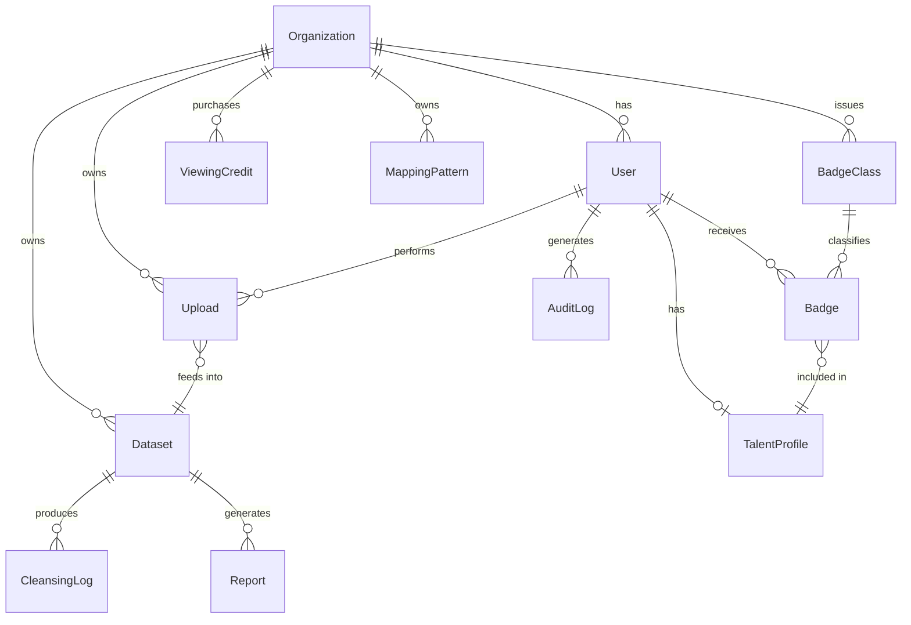

#### 6.2.3 Class Diagram (도메인 서비스 계층)

> 핵심 도메인 서비스 클래스와 Entity 간 의존·소유·연관 관계를 정의한다.

```mermaid
classDiagram
    class UploadService {
        +uploadFiles(files, orgId) Upload[]
        +getUploadStatus(uploadId) UploadStatus
        +getMappingPreview(uploadId) MappingResult
        +confirmMapping(uploadId, mappingData) void
        -detectFormat(file) FileFormat
        -storeFile(file) StoragePath
    }

    class AIMappingEngine {
        +analyzeSchema(file) SchemaAnalysis
        +generateMapping(source, target) MappingResult
        +learnPattern(orgId, mapping) void
        +getPattern(orgId) MappingPattern
        -inferColumns(source) ColumnMapping[]
        -calculateConfidence(mapping) float
    }

    class DataHubService {
        +mergeDatasets(uploadIds) Dataset
        +cleanseData(datasetId) CleansingResult
        +applyFix(datasetId, fixData) void
        +queryData(filters) DataPage
        +getVersionHistory(datasetId) Version[]
        +rollback(datasetId, versionId) void
        -detectAnomalies(data) Anomaly[]
        -calculateQualityScore(dataset) float
    }

    class ReportService {
        +generateIntegrityReport(datasetId) Report
        +exportReport(reportId, format) File
        +scheduleReport(config) Schedule
        -validateReport(report) ValidationResult
        -renderPDF(report) File
        -renderExcel(report) File
    }

    class BadgeService {
        +issueBadge(learnerId, classId) Badge
        +verifyBadge(badgeId) VerificationResult
        +evaluateEligibility(learnerId) EligibilityResult
        +getRules() BadgeRule[]
        +updateRules(rules) void
        +getDashboardKPI() BadgeKPI
        -checkCriteria(statements, rules) boolean
    }

    class TalentService {
        +searchProfiles(filters) TalentProfile[]
        +getProfile(profileId, creditId) TalentProfile
        +sendInterestNotification(profileId, mode) void
        +trackViewToInterview(profileId) ConversionRate
        -deductCredit(orgId) void
    }

    class DashboardService {
        +getROIData() ROIDashboard
        +getMatchingKPI() MatchingKPI
        +getQualityScores() QualityRanking[]
        +saveLayout(userId, layout) void
        +exportDashboard(format) File
        -aggregateMetrics() Metrics
    }

    class AuthService {
        +authenticate(credentials) Token
        +authorize(token, resource) boolean
        +lockAccount(userId) void
        -validateToken(token) Claims
        -hashPassword(password) string
    }

    class LTIService {
        +handleLaunch(launchData) Session
        +receiveEvent(event) void
        -parseContext(launchData) UserContext
        -convertToXAPI(event) Statement
    }

    class NotificationService {
        +sendEmail(to, template, data) void
        +sendPush(userId, message) void
        +sendWebhook(url, payload) void
        +updatePreferences(userId, pref) void
    }

    class Organization {
        +org_id: UUID
        +org_name: string
        +org_type: OrgType
        +region: string
        +tier: Tier
    }

    class User {
        +user_id: UUID
        +email: string
        +role: Role
        +is_locked: boolean
    }

    class Upload {
        +upload_id: UUID
        +file_format: FileFormat
        +status: UploadStatus
        +mapping_result: JSON
    }

    class Dataset {
        +dataset_id: UUID
        +version: int
        +status: DatasetStatus
        +quality_score: float
    }

    class Report {
        +report_id: UUID
        +report_type: ReportType
        +status: ReportStatus
        +validation_result: JSON
    }

    class Badge {
        +badge_id: UUID
        +assertion_json: JSON
        +verification_url: string
        +is_revoked: boolean
    }

    class TalentProfile {
        +profile_id: UUID
        +badges: JSON
        +learning_summary: JSON
        +is_public: boolean
    }

    UploadService --> AIMappingEngine : uses
    UploadService --> DataHubService : feeds data
    UploadService ..> Upload : manages
    AIMappingEngine ..> MappingPattern : reads/writes
    DataHubService ..> Dataset : manages
    DataHubService ..> CleansingLog : produces
    ReportService --> DataHubService : queries data
    ReportService ..> Report : manages
    BadgeService ..> Badge : issues
    BadgeService ..> BadgeClass : configures
    TalentService --> BadgeService : verifies badges
    TalentService ..> TalentProfile : manages
    TalentService ..> ViewingCredit : consumes
    DashboardService --> DataHubService : aggregates
    DashboardService --> BadgeService : queries KPI
    DashboardService --> TalentService : queries KPI
    LTIService --> BadgeService : triggers evaluation
    NotificationService --> User : notifies
    AuthService ..> User : authenticates
    Organization "1" --> "*" User : employs
    User "1" --> "*" Upload : performs
    User "1" --> "0..1" TalentProfile : owns

    class MappingPattern {
        +pattern_id: UUID
        +confidence_score: float
    }
    class CleansingLog {
        +log_id: UUID
        +error_type: ErrorType
    }
    class BadgeClass {
        +badge_class_id: UUID
        +criteria_rules: JSON
    }
    class ViewingCredit {
        +credit_id: UUID
        +remaining_credits: int
    }
```

### 6.3 Detailed Interaction Models (상세 시퀀스 다이어그램)

#### 6.3.1 상세 시퀀스: 파일 업로드 → AI 매핑 → 데이터 정제 → 리포트 생성 (End-to-End)

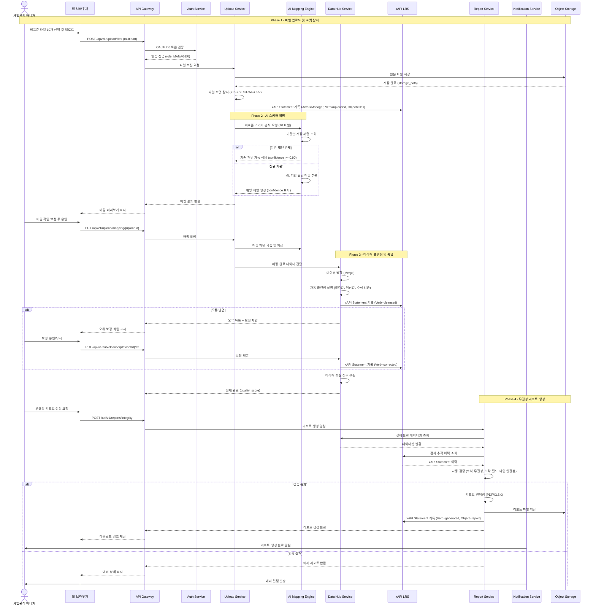

#### 6.3.2 상세 시퀀스: Local Fit Badge 발급 (자동 판정 프로세스)

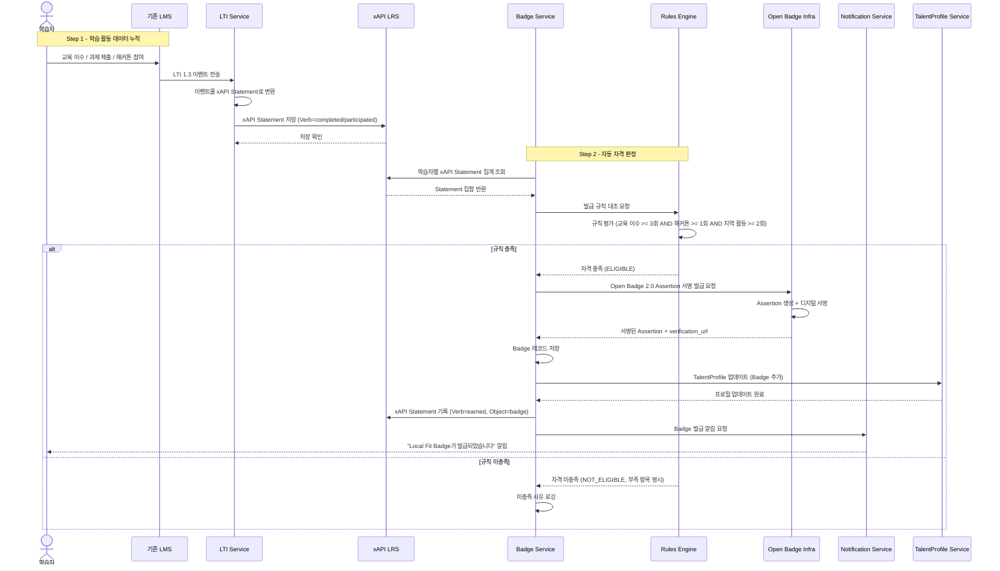

#### 6.3.3 상세 시퀀스: 기업 HR 인재 열람 → 관심 표시 → 면접 전환 추적

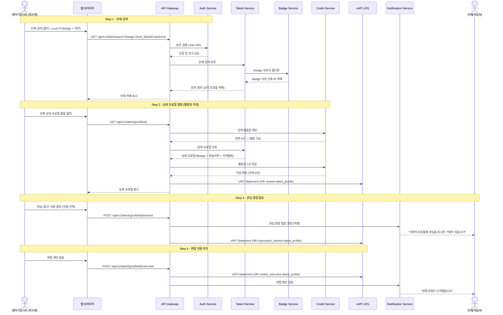

#### 6.3.4 상세 시퀀스: ROI·성과 대시보드 데이터 집계

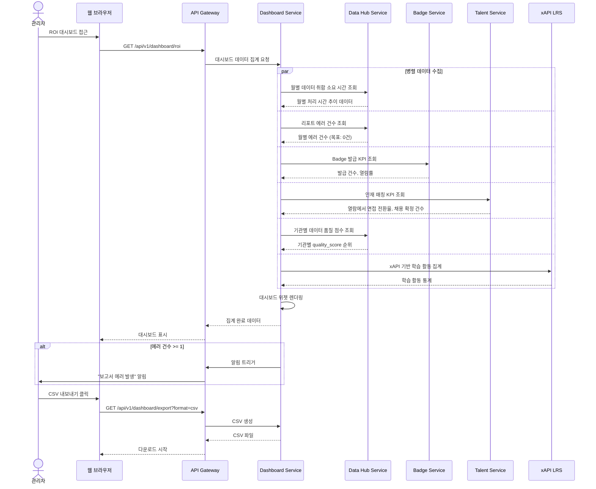

### 6.4 Validation Plan (검증 계획)

> PRD §10-2 핵심 가설 및 검증 실험 매트릭스를 기반으로 작성.

| 실험 ID | 검증 대상 가설 | 실험 방법 | 성공 기준 | 측정 도구 | 관련 Req |
|:---|:---|:---|:---|:---|:---|
| E1 | H1: AI 매핑으로 데이터 취합 48h → 1h | MVP 배포 후 3개 파일럿 기관 실제 처리 시간 측정 | <= 1h/월 달성률 80% 이상 | Mixpanel 퍼널 트래커, 업로드 로그 타임스탬프 | REQ-NF-001, REQ-FUNC-002 |
| E2 | 보고서 에러율 0건 달성 | 베타 기관 데이터 클렌징 에러율 A/B 테스트 (수작업 vs 시스템) | 시스템 클렌징 에러율 0건/월 | 보고서 버전 이력 시스템, 에러 로그 | REQ-NF-022, REQ-FUNC-018 |
| E3 | Local Fit Badge 보유자 재직률 향상 | Badge 보유자 vs 미보유자 12개월 재직률 비교 코호트 | Badge 보유자 이탈률 <= 10% | HR 대시보드, 입사 후 12개월 재직률 추적 | REQ-NF-023, REQ-FUNC-019 |
| E4 | H2: Badge가 면접 전환율 향상 | HR 담당자 대상 Badge 열람 → 면접 전환율 측정 | 전환율 >= 30% | xAPI LRS (열람→면접 이벤트 추적) | REQ-FUNC-027, REQ-FUNC-023 |
| E5 | H3: Star 세그먼트 Phase 1 계약 전환 | C-3/C-2 파일럿 계약 3건 이상 추진 | M9까지 계약 3건 | 계약 관리 시스템 | CON-05 |
| E6 | 경쟁사 3-블록 공백 유지 확인 | 경쟁사 기능 매트릭스 정기 업데이트 | 동시 통합 플레이어 부재 확인 | 분기별 벤치마킹 보고서 | — |
| E7 | RISE First-mover 기회 창 확보 | C-3/C-2 기관 파일럿 계약 체결 속도 측정 | Phase 1 내 3건 선점 | 계약 체결일 트래킹 | CON-05 |
| E8 | H4: Cascade 파급 효과 (3.5배 확산) | 전산처 도입 후 산하 기관 연쇄 도입율 추적 | 산하 기관 도입율 >= 70% | 기관 도입 이력 대시보드 | — |

---

### 7. 미결 사항 (Open Issues)

본 MVP 시스템 (Phase 1) 구축 전후로 확정이 필요한 파생 이슈 3건을 기록한다.

1. **LLM 활용 범위 한계선 설정**
   - 현재 AI는 비표준 엑셀 스키마 매핑(F1)에만 사용 제안 중이나, 추후 무결성 리포트의 피드백 코멘트 자동 작성 등 추가 확장이 필요한지 확정이 필요함 (토큰 비용 직결).
2. **Push / 이메일 노티스 전환 방식**
   - 알림(Notification) 발생 시 인앱 알림(DB 기록)으로 끝낼 것인지, 실제 외부 이메일 API(Resend, AWS SES 등)를 초기부터 연동할지 결정 필요.
3. **Vercel Plan 옵션과 엑셀 처리량 충돌 (Timeout)**
   - Vercel Serverless 함수의 무료(Hobby) 계정 한도는 10초, Pro 계정은 5분. 대량의 엑셀 파일을 AI로 파싱할 때 10초 초과 시 에러 발생 가능. 클라이언트 단 분할 처리, 백그라운드 큐 도입, 혹은 Pro 업그레이드 등 아키텍처 방어벽 선정이 필요함.

---

*— 문서 종료 — SRS-001 v1.0*
*작성일: 2026-04-15 | 기준 문서: VPS v1.0 (PRD)*
*표준: ISO/IEC/IEEE 29148:2018*
